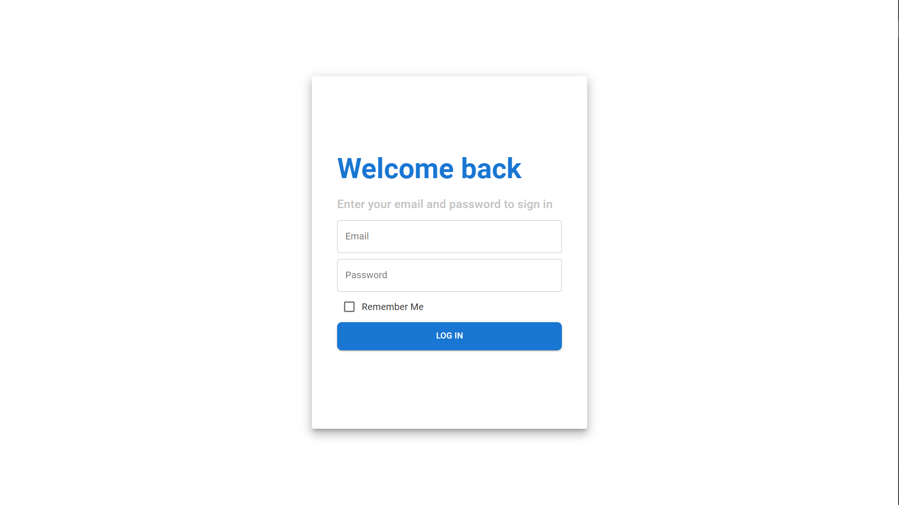
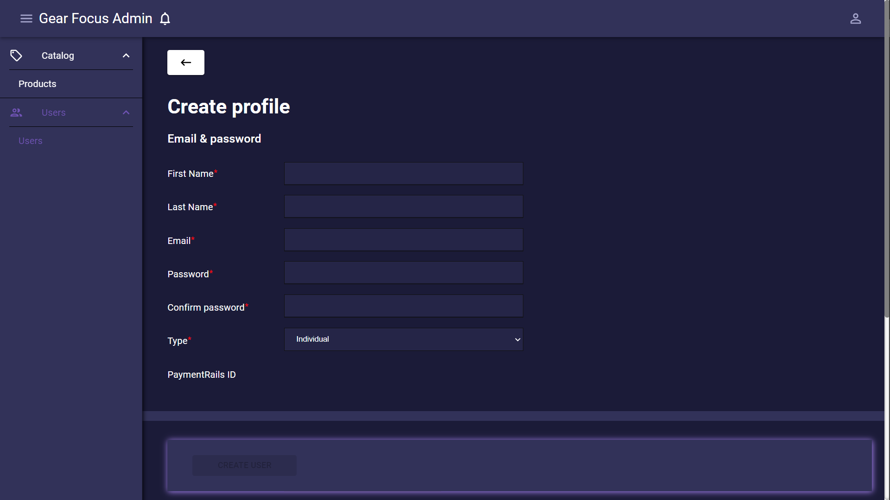

# Admin Dashboard Page
Language: TypeScript.
Technology: ReactJS, Redux
Library: Material UI, React Hook Form.

## Login by Email

- [x]  Login with Email & Password.
- [x]  Form validate.
- [x]  Remember login with Cookie.

#### Preview

## Manage Users
#### User List
- [x]  Get User List with filters.
- [x]  Searching by keyword.
- [x]  Sort User List Table Row by Email, Name, Date Created, Date Last Login.
- [x]  Click Email or Name => redirect to User Detail Page.
- [x]  Delete users selected.

#### Preview

#### Create/Update User
- [x]  Create new User or Update User.
- [x]  Form validate.

#### Preview

## Manage Products
#### Profuct List
- [x]  Get Product List with filters.
- [x]  Searching by keyword.
- [x]  Sort Product List Table Row by SKU, Name, Price, In stock, Vendor, Arrival Date.
- [x]  Click Name => redirect to Product Detail Page.
- [x]  Delete product selected.

#### Preview

#### Create/Update Profuct
- [x]  Create new Product or Update Product.
- [x]  Form validate.

#### Preview

## Thank You for Visiting